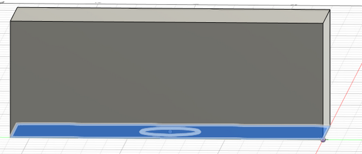
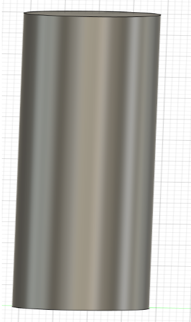
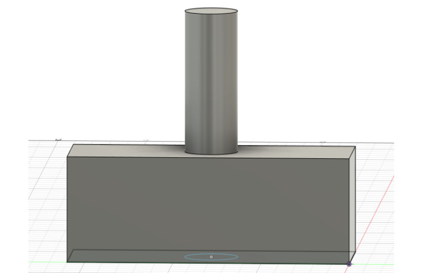

## Assignment 00   - lage web side & føste prosjektideer

Bruk DOCS for å se prosjektfilene, git pages klarte ikke å håndtere bilder

Her er min google docs for 
[Ideer for prosjekt](https://docs.google.com/document/d/1Gtd3E4MM41uL1XNtwIZ1ojKJA5nZlT6XIVdund5ngDY/edit)

Bildan har slutta å laste opp for enkelte bilder......
29.09.2023

## Fremgangsrapport - webside
Nettsiden er oppeå går

Får limt inn bilder nå

## Prosjektideer

- Lys/vekkerklokke - kombinert
- Lås
- Perienner
- Drone

## LYS/VEKKERKLOKKE - KOMBI

Ønsker at lyset er bærbart - batteribasert

Ønsker å gjør lyset slik at det kan være vanlig lys, discolampe og wakeup light etter innstilling i applikasjon
Må kunne kobles i taket i leiligheten	(gjenning)
Må kunne kobles til vekkerklokken
Må være et selvstendig lys også

Resultatet vil være et lys, som vil ha 3 forskjellige innstillinger for lyset

Vekkerklokken vil være helt basic, og vil være ladestasjonen til lyset
Vekkerklokken må ha en klokke
Strøm til lyset og seg selv
Kan inneholde “lyder” under wakeup modus på lys
Styrt via applikasjon, der man kan endre/laste opp egne lyder
Styrer vekkefunksjonen
Styrer lysmodus
Flere?

Vekkerklokken

Lys

Kombinert sammen

Bildene kom ikke med i 1 omgang
Må evaluere hvordan den skal stå, da det ikke er lys

LÅS - mulig?

Døralås type yaleman ich

Kan låses opp med app (kode) , biometrics eller kode (dagskode/ukeskode) 

Er dette mulig? -> begrenset av materialer? 

Enkel lås med fungerende funksjonalitet

AUTOMATISK PERSIENNER?
Motor
Kjøre persienner opp/ ned

Må festes øverst i vindu / dør		-> 

Appstyrt	-> “Smarthus”

DRONE?

Bygge 5 droner, som kan programmeres via en app
Fungere i 3D rommet		-> Teste å fly over fotballbanen

Vanskelig å lage?
Mulig å bli ferdig?

Prøve senere? 
