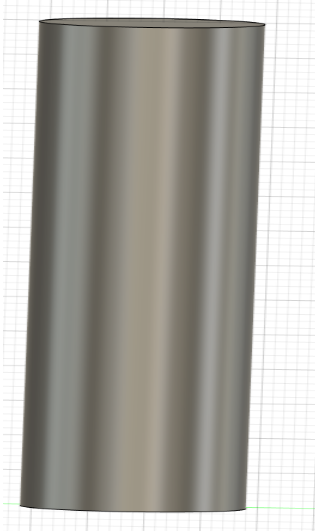
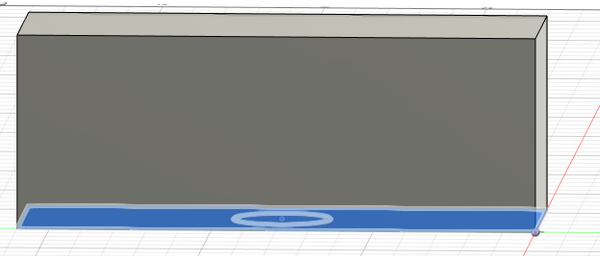

## Assignment 01: Make a CAD model of your final project

Frist søndag 17. september

Få godkjent ide/prosjekt

satser på å skrive ut, for å se hvordan de blir

Det blir 2 ledd i prosjektet, der de er uavhenig av hverandre, men kan settes sammen.
Derfor trenger man en "hurtiglås" , klikk/skru.

Klokken skal fungere som en ladestasjon for lyset, samt vekkelyd.
Trenger da strøm og en høytaler til dette.

Sender/mottaker      -> Den må også kunne starte lysvekkefunksjonen hos lyset.
ACK fra lyset?

For lyset trenger en lik sender/mottaker
Kobles fra til selvstendig bruk.
Partylys        -> Egen funksjon
Vekkerklokke    -> Gradvis oppvekking
Lys             -> vanlig lys

Appstyrt, samt styrt via manuelle kontrollere

Spørsmål fra fagets side:
    What are the different parts that the design require?
    What manufacturing processes does it require?
    Do I need any external components (fasteners, bearings, etc.)?
    Is there mechanical movement? If so, how does it work?

Men kan kokes ned i "hvordan skal prosjeket gjennomføres?"

Enkelt svart: Har ikke anelse

Må kunne endre design og endringer senere

Men det må endel elektronikk og kode

Skal være nok med 2 seperate deler og en kobling mellom dem

Vet ikke om prosjektet er gjennomførbart? 