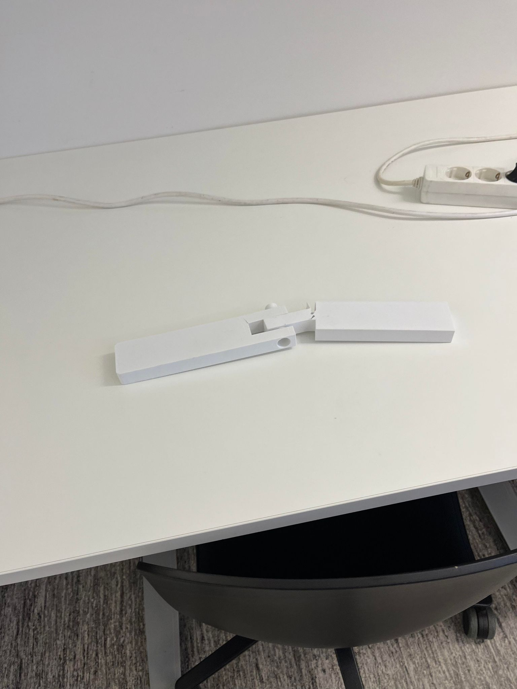
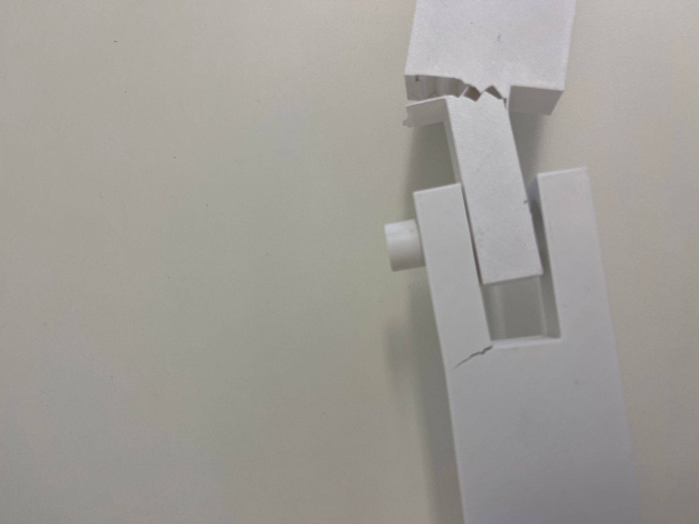
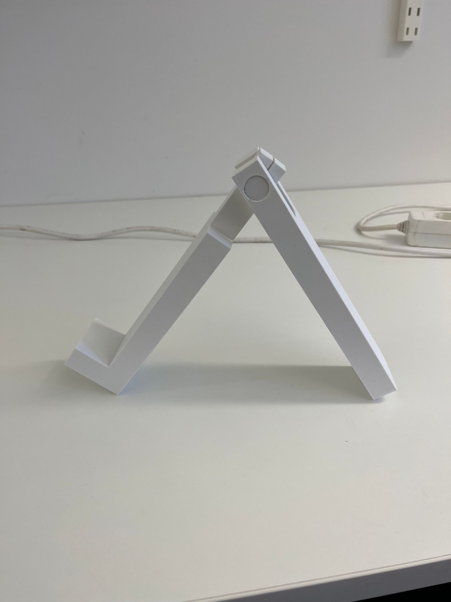
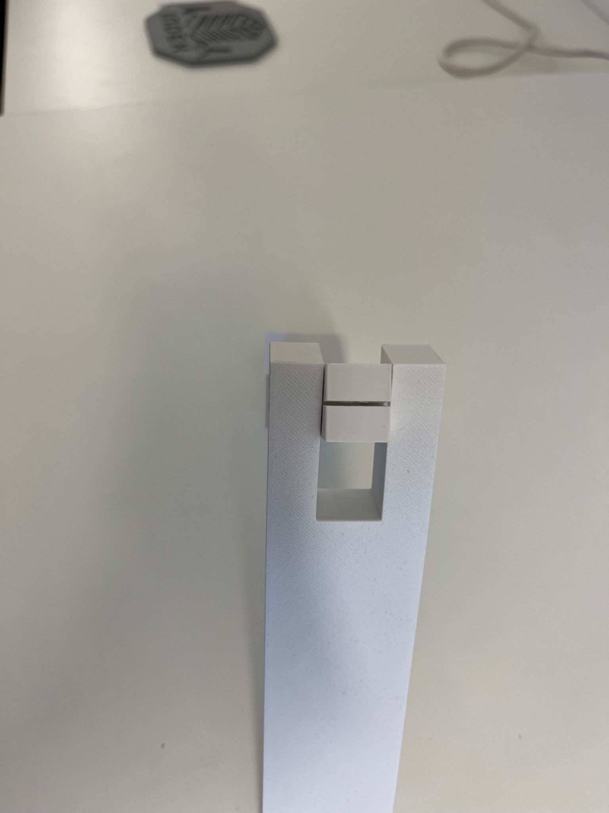
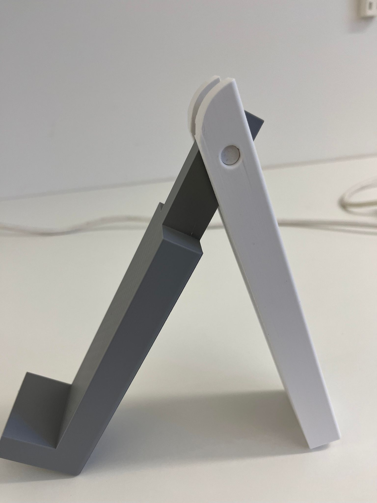
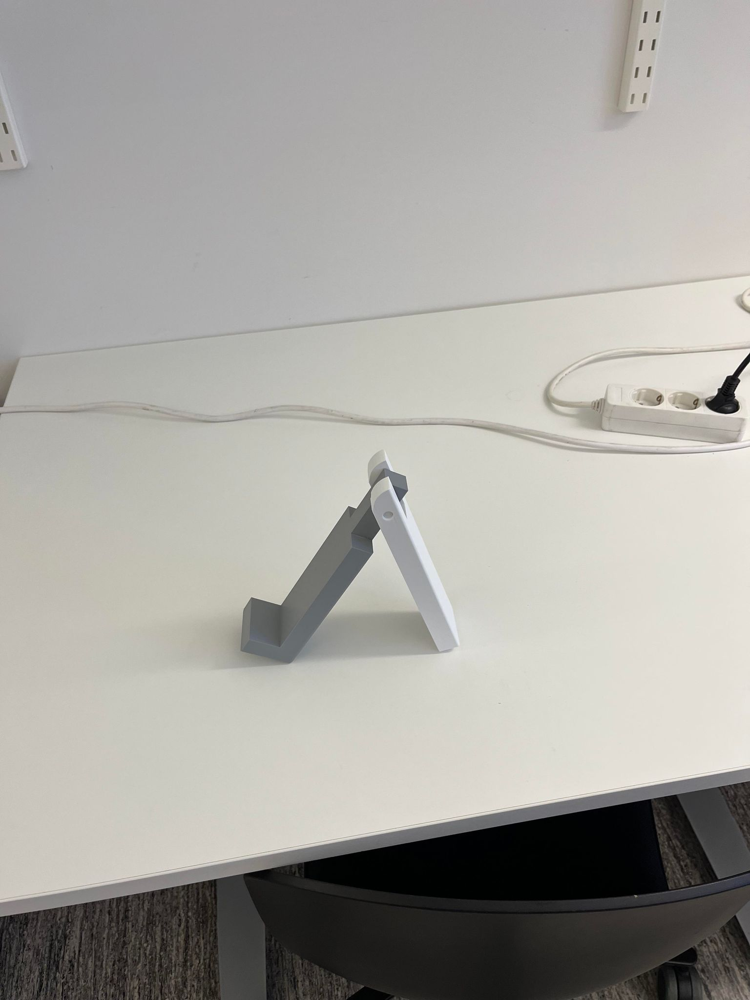
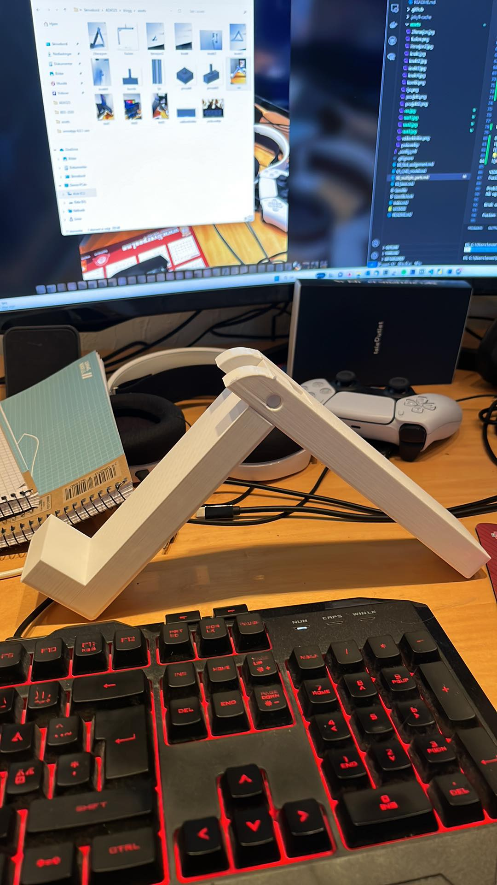
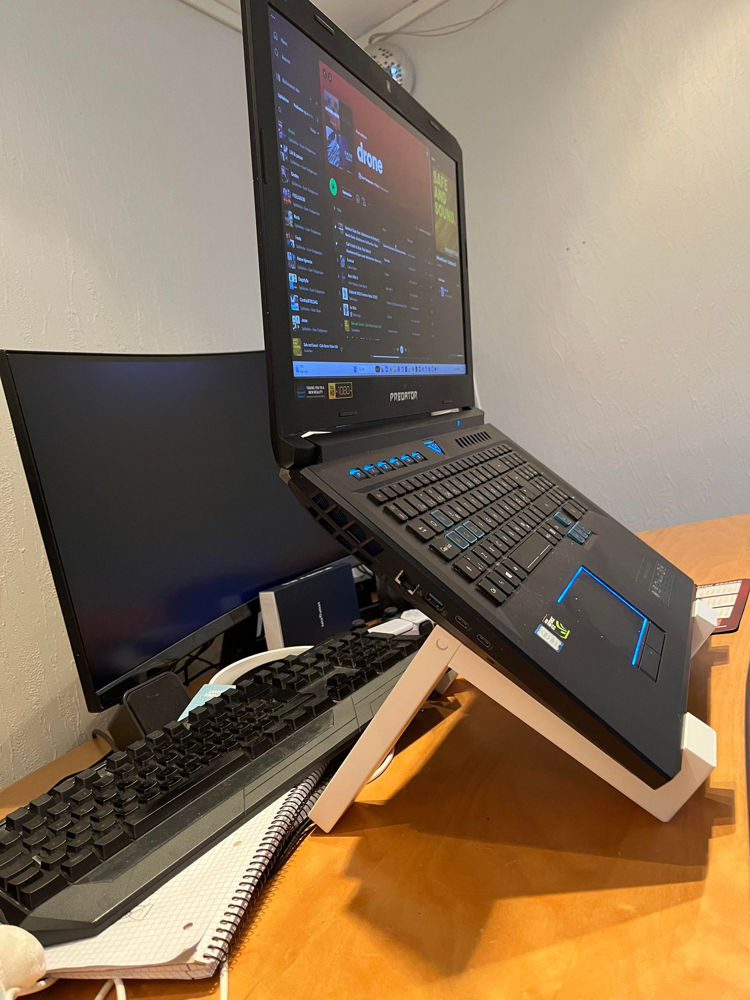
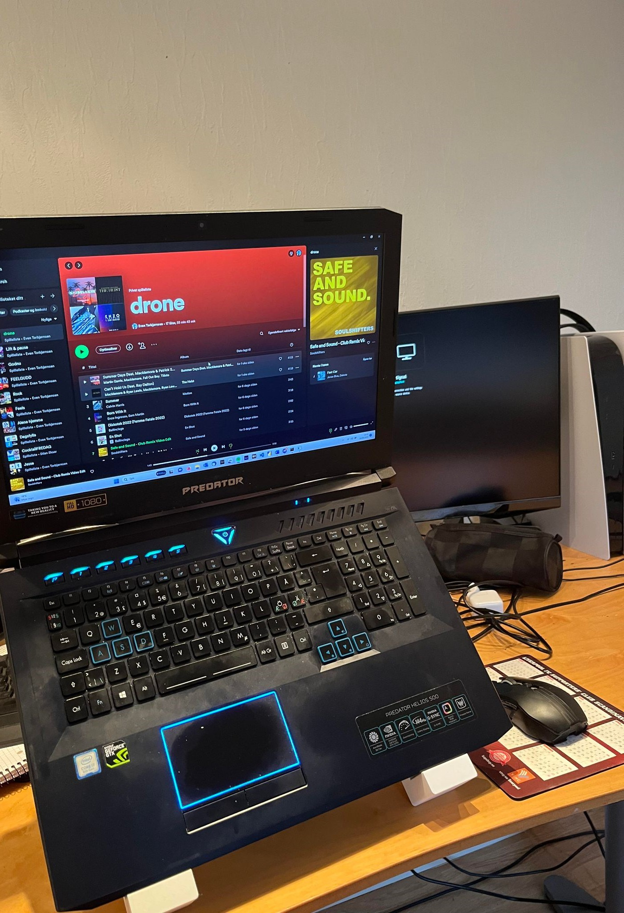
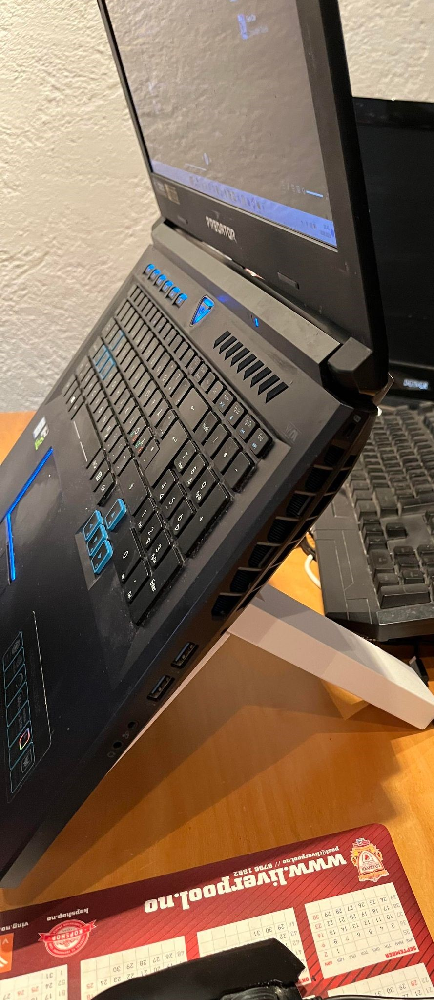

## Assignment 02: 3D print a design that combines multiple parts

Frist: søndag 17.september

Bilder blir lastet opp på mandag, siden jeg ikke fikk til / tatt bilde av de gamle delene

For dette prosjeket ble valget et stativ til PC

Det består av 2 deler, en for støtte, og en for å plassere datamaskinen på.
Det skal være en pin igjennom, som gjør at delen ikke sklir ifra hverandre

Datamaskinen er tung, ca 4 kg , og 17 tommer stor.

De to delene er lagd meget enkel, og forbundet med en pin, gjennom hull i delene. 
Dette er bedre illustert på bildene

Det ble gjennomført 3 iterasjoner, der den første var til test, mens nr 2 skulle være ferdig produkt.
En tredje iterasjon måtte gjennomføres pga feil på sketches og filen som ble lastet opp i bambu.

Siden prosjektets dato, og tilgang på printer var kritisk, så ble det ikke gjennomført flere iterasjoner.

Iterasjon 1
Pin størrelse: 16 mm
Strørrelse hull: 16 mm

Delene ble printet på et prøve stadie, for å evaluere modellene
Det ble problemer med å hente ut pin, og "demotere modellen"

Resultatet ble knust modell

Iterasjon 2
Endret litt på designet, og printet nye runde.
Håpa det skulle endringen skulle være gode nok til at etter print, skulle være godt nok
Det ble ikke slik jeg håpet, og klarte ikke å holde pcen.
Dermed måtte man gjennom en ny runde, med design endringer, og printing

Pin størrelse: 7.8 mm
Strørrelse hull: 8 mm

Det fungerte å sette opp, men hadde problem med å sette PC på stativet
Det har med vinkel å gjøre

Iterasjon 3
Skulle være ferdig produkt, men har ikke forbundet sketches på 2 forskjellige plan
Dermed ble ikke hullene gjennomført, slik at de var contrainet av hverandre, som førte til at hullene ikke stemte overens, og kunne ikke kobles sammen.

Et annet problem var at lengden på foten, ble endret, slik at den ble kortere. Det gjør at støtteflaten ikke er så stor som den burde for PC. 

Resultatet ble: 

For å kunne ha noe å vise fram, så hentet jeg støtten fra iterasjon 2.
Den som jeg hadde "forkastet" på den ble stikkende over, slik det er vist på bildet under iterasjon 2.

Dermed fikk jeg dette resultatet.

Siden resultatet ble slik som vist over, så ble foten som holder PCen for kort. Det gjør at støtteflaten til PCen er for liten, og det gjorde at den raserte 20 sekunder etter bildene var tatt....

VIDERE ARBEID:
Fusion - bedre design & forståelse av hierakiet på tidslinjen. Kombinere sketches på ulike plan (x,y), (x,z) og (y,z) for å kunne modellere og contraine på tvers av dem.

Må også se på joint (j) for å kunne binde delene sammen, slik at man kunne "simulere" delene etter de er sammensatt

Bruk automasjonsgjengen mer aktivt til å lære mer

Fusion skills som helt klart ødela for prosjeket

