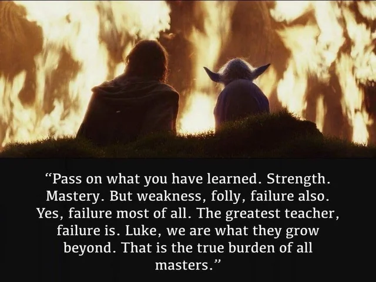

## Assignment 02: 3D print a design that combines multiple parts

Frist: søndag 17.september

Bilder blir lastet opp på mandag, siden jeg ikke fikk til / tatt bilde av de gamle delene

For dette prosjeket ble valget et stativ til PC

Det består av 2 deler, en for støtte, og en for å plassere datamaskinen på.
Det skal være en pin igjennom, som gjør at delen ikke sklir ifra hverandre

Datamaskinen er tung, ca 4 kg , og 17 tommer stor.

De to delene er lagd meget enkel, og forbundet med en pin, gjennom hull i delene. 
Dette er bedre illustert på bildene

Det ble gjennomført 3 iterasjoner, der den første var til test, mens nr 2 skulle være ferdig produkt.
En tredje iterasjon måtte gjennomføres pga feil på sketches og filen som ble lastet opp i bambu.

Siden prosjektets dato, og tilgang på printer var kritisk, så ble det ikke gjennomført flere iterasjoner.

Iterasjon 1
Pin størrelse: 16 mm
Strørrelse hull: 16 mm

Delene ble printet på et prøve stadie, for å evaluere modellene
Det ble problemer med å hente ut pin, og "demotere modellen"

Resultatet ble knust modell

Iterasjon 2
Endret litt på designet, og printet nye runde.
Håpa det skulle endringen skulle være gode nok til at etter print, skulle være godt nok
Det ble ikke slik jeg håpet, og klarte ikke å holde pcen.
Dermed måtte man gjennom en ny runde, med design endringer, og printing

Pin størrelse: 7.8 mm
Strørrelse hull: 8 mm

Det fungerte å sette opp, men hadde problem med å sette PC på stativet
Det har med vinkel å gjøre

Iterasjon 3
Skulle være ferdig produkt, men har ikke forbundet sketches på 2 forskjellige plan
Dermed ble ikke hullene gjennomført, slik det skulle. De er ikke overkommelig

Prøve å jukse til et resultat, ved hjelp av annen støtte, men den raserte.
Prøve ny print over helgen - tirsdag, og legge inn et bilde for resultat
Siden printingen ble gjort i helgen, fikk jeg også dårlig tid til å gjennomføre en ny print for å prøve igjen

Resultatet ble: 

Ett ikke komplett arbeid, pga feil ved sketches, og dermed får uoverstemmelser når delene printes.

VIDERE ARBEID:
Fusion - bedre design & forståelse av hierakiet på tidslinjen. Kombinere sketches på ulike plan

Problemet ble at endring på en del ikke ble gjenspeilet i en annen del -> Constraints
Må også se på joint (j) for å kunne binde delene sammen, slik at man kunne "simulere" delene sammen

Bruk automasjonsgjengen mer aktivt til å lære mer

Fusion skills som helt klart ødela for prosjeket

