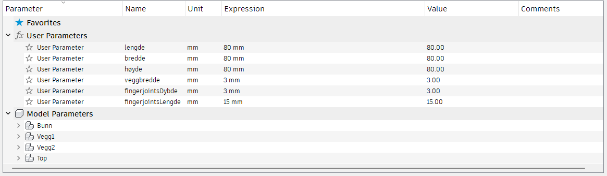
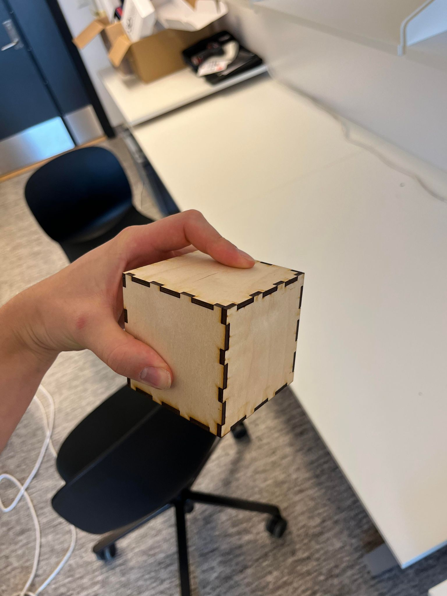
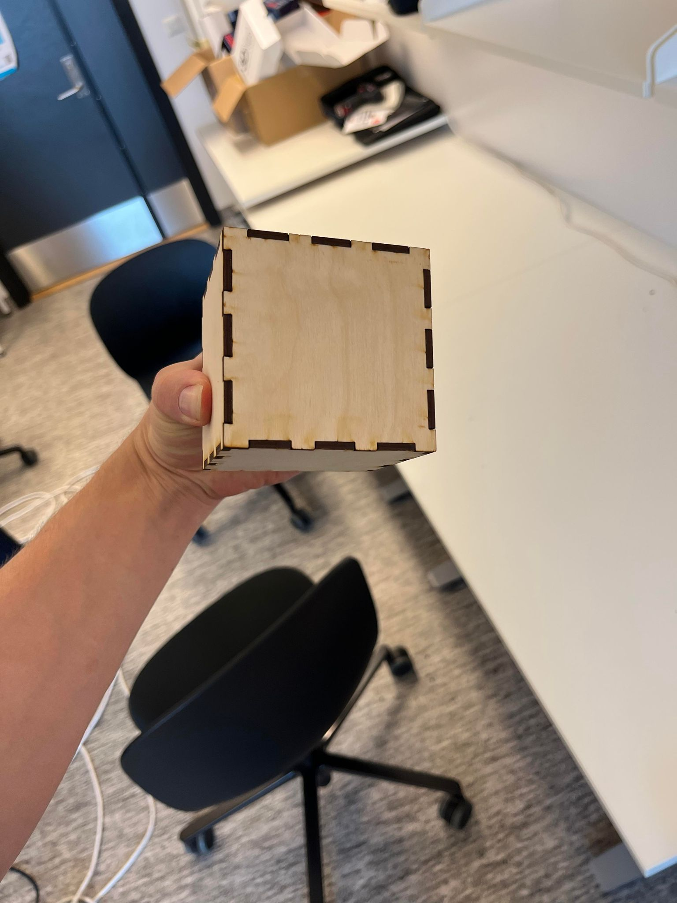
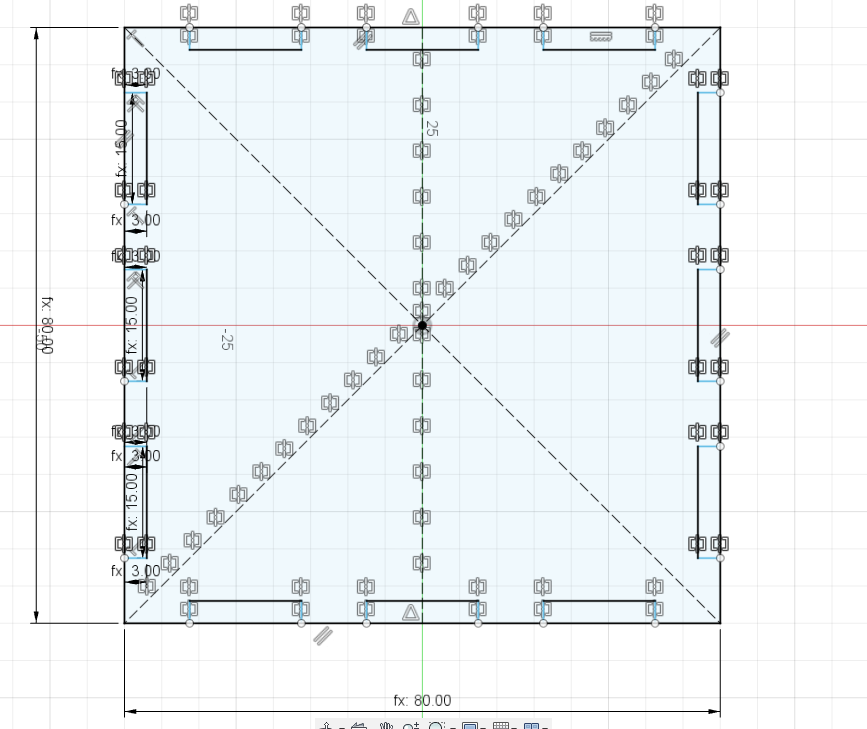

## Assignment 03: Laserkutting

Work smart, not hard

https://www.youtube.com/watch?v=ZrcqauNvt0M

Helt til slutt måtte jeg lage mirror "gulvet", slik at jeg fikk en topp

Paramterics:

Resultat:

Alle sidene er avhenig av hverandre, slik at endring i parameterne enderer for alle sidene i Fusion.
Et problem er at siden jeg har brukt mirror, så må boksen være kvadratisk, hvis ikke blir det skeivt i mirrordelen.
Det er fordi jeg har brukt konstuksjonslinjer på skrå av boksen, for å bare må designe en side og mirror rundt samtlige linjer.

Lagde en komponent for hver del, så fikk bunn, topp, side1 og side 2.
Der jeg skjærte ut side1 og side2, 2 ganger hver.

Før klagjøring til skjæring, så ble det lagd en ny sketch basert på komponent, slik at man bare skjærer en linje 1 gang, og ikke 2.
Videre ble det lagd en offset på 0.01 mm på alle delene, som var litt for lite. Kunne sikkert kjørt 0.05 mm

Hadde vi hatt bedre til, så kunne man lagd hinge, slik at man kunne "klemme" sammen. Hullene her var 15 mm x 3 mm i fingerjointsene. Fremfor å ha begge til 15, kunne man justert "koblingshullene" til 14.5 mm, og lagd hinge på utstikkerne.
Slik at de klemmes sammen med montering, og utvider seg til opprinnelig posisjon, og dermed lager setter boksen i "klem".

Hadde trengt litt lengre tid for det.

Hvordan kan jeg bruke dette i prosjektet?

Kan vell kutte hull i ting, kan skjære ut refleksjonsdeler?
Kan bruk til å kutt opp delan? 

Lengre har jeg ikke tenkt.

