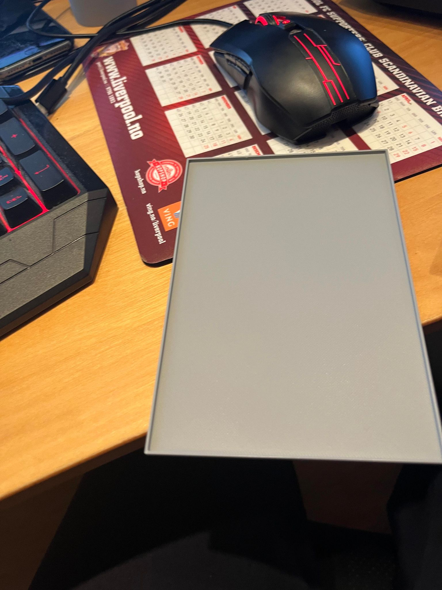
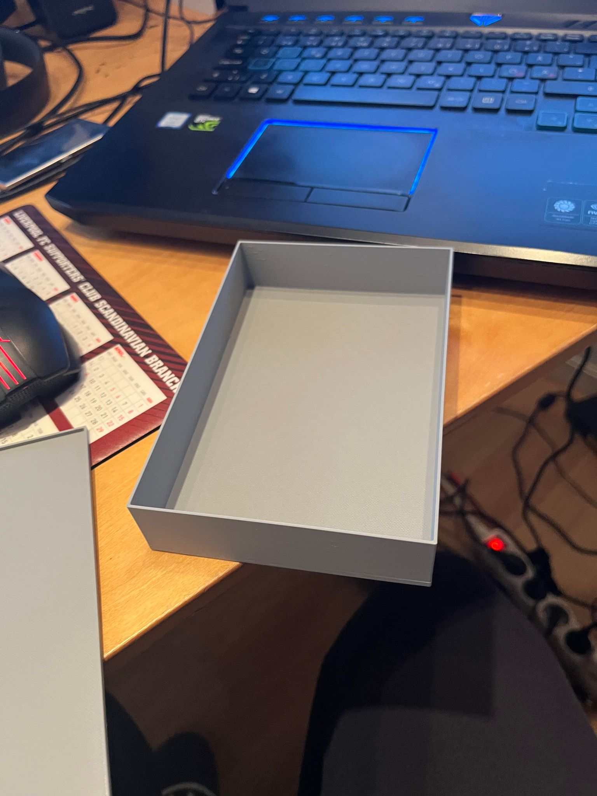
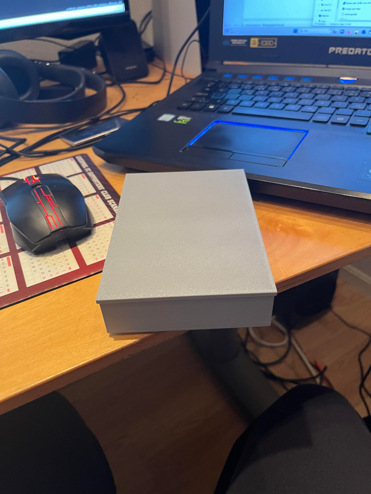
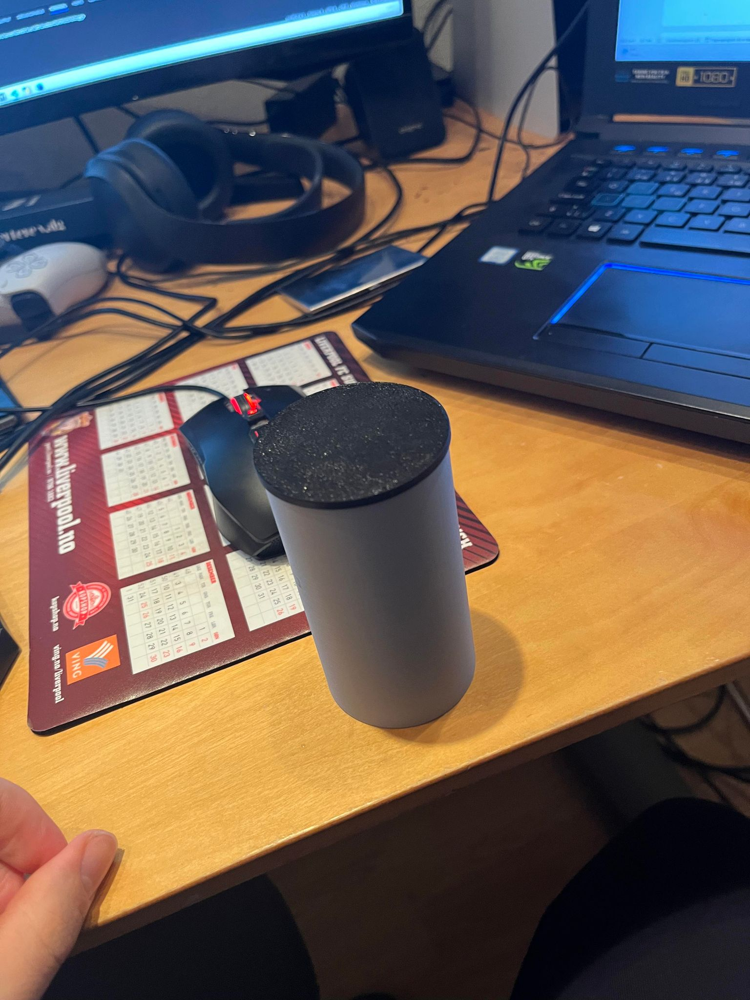
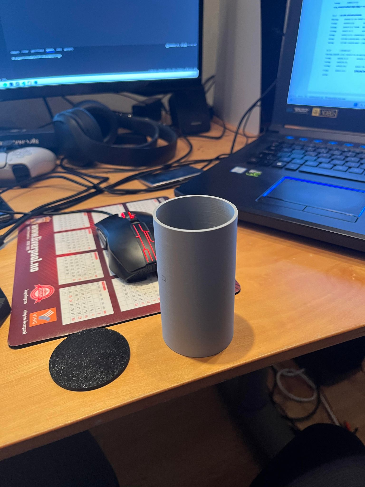
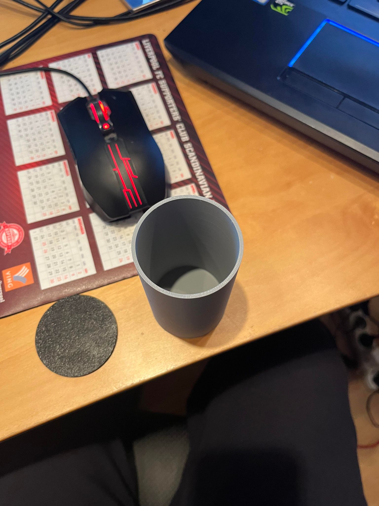

## Protoype 1

Dette er det første prototypen, som er produsert av klokken.

Prototypen er enkelt 3D printet.

Klokkedelen er kjedelig firkant, uten noe spesielt.

Lyset skal kunne slås på med 3 forskjellige lysfrekvenser
Svak, middels og sterk

Ønsker å kunne sette modus for å slå seg på gradvis iløpet av 30 min
Settes klokke via nett

Tenker det på nåverende tidspunkt ikke er bedre måte å fabrikere dette, enn med additaive fabrikkering.
Legger joiner delene og printer ut de 4 inividuelle delene.
Prototype 1 ble generert opp meget kjapt, og er lagd for å kunne se på plass av elektronikk.

Hva har jeg lært?
Lært mye i kurset, som jeg ikke hadde et forhold til tidligere.

Det som mangler er:
Elektronikk
En lås mellom klokken og lyset.
Komplett design / endring av design
Interaksjon med lyset
Hvordan jeg setter timer for påslåing av lys
Mye mer som jeg kommer på underveis

Neste steget i prosjektet er å få et forhold til elektronikken, og om delene må endre i størrelse. Så ser vi hvordan vi interakterer sammen med klokken.
Lage en hurtigjoint lås mellom klokken og lyset.

