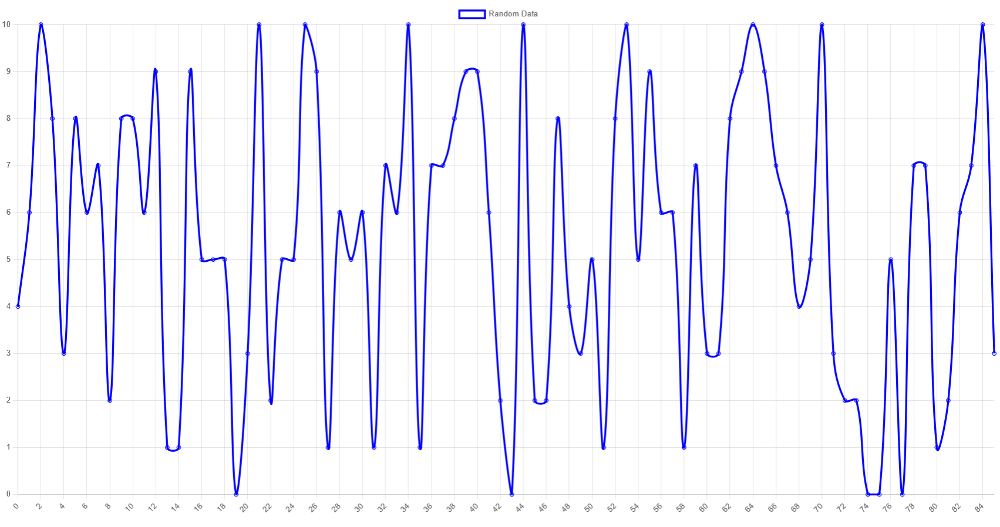

## Client/Server

Sendte data fra serversiden hvert sekund. Opprettet en lytter på websiden, som oppdaterte tabellen når det kom input fra server.
Kan brukes til å vise tempratueren, luftfouktighet og andre data fra sensoren i klokken.

Bruke livecharts for å vise de randomiserte dataene.

Vil at serveren har data, og kartlegger den. Videre ønsker jeg at ved tilkoblet klient, så sendes data fortløpende. Mer på prosjektets neste innlervering.

Github: https://github.com/591118/ADA525_platformIO/tree/main/nodejs

Bilde: 

Video: 