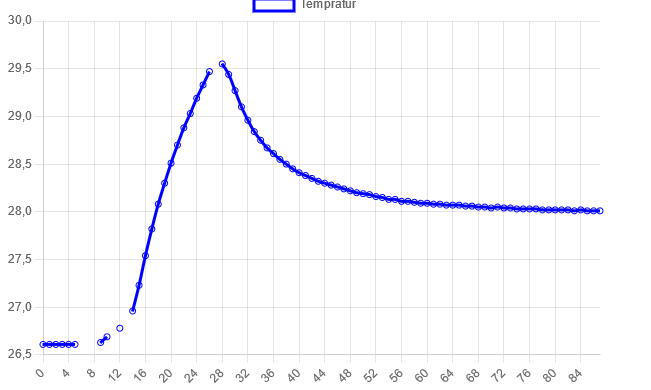

## Client/Server - del 2

Kode: https://github.com/591118/ADA525_platformIO

Det er laget en server, der en klient legger seg til.
Sender data mellom adurion - tempratur, og bruker i chart

Chart har en liten feil, og ved endring av brightness, hopper over et punkt. Dette er vist i bildet, og der den blå linjen ikke er koblet, er der jeg har sendt data til adruino.

Vi sender data via slideren til adruino, og justerer lysstyrken via dem.

Bilde : 

Demo: 